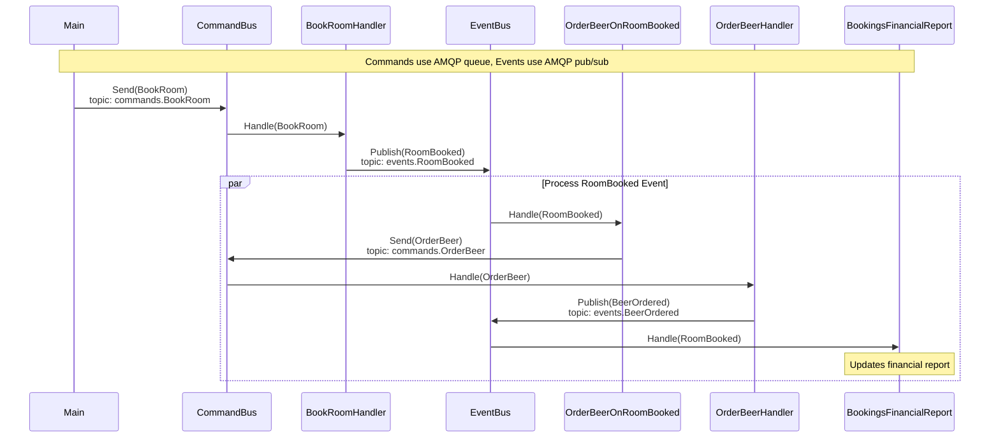

# Example Golang CQRS application

This application is using [Watermill CQRS](http://watermill.io/docs/cqrs) component.

Detailed documentation for CQRS can be found in Watermill's docs: [http://watermill.io/docs/cqrs#usage](http://watermill.io/docs/cqrs).





## Running

```bash
docker-compose up
```
