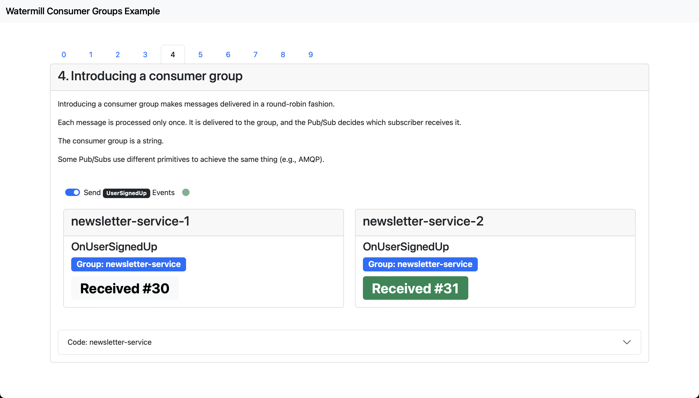
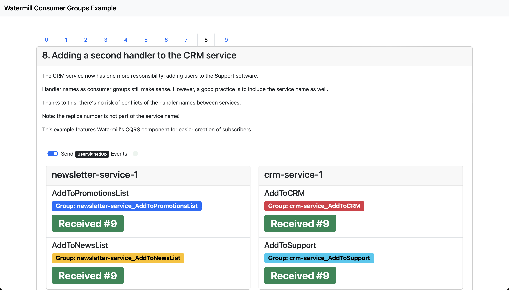

# Interactive Consumer Groups Example (Routing Events)

This example shows how Customer Groups work, i.e. how to decide which handlers receive which events.

Consumer Group is a concept used in Apache Kafka®, but many other Pub/Subs use a similar mechanism.

The example uses Watermill and Redis Streams Pub/Sub, but the same idea applies to other Pub/Subs as well.

## Live video

This example was showcased on the Watermill v1.2 Launch Event. You can see the [recording on YouTube](https://www.youtube.com/live/wjnd0Hj6CaM?t=1020) (starts at 17:00).

[](https://www.youtube.com/live/wjnd0Hj6CaM?t=1020)

## Running

```
docker-compose up
```

Then visit [localhost:8080](http://localhost:8080) and check the examples in each tab.

## Screenshots





## Code

See [crm-service](crm-service) and [newsletter-service](newsletter-service) for the Watermill handlers setup.

## How does it work?

This example uses SSE for pushing events to the frontend UI. See the [other example on SEE](../server-sent-events) for more details.
