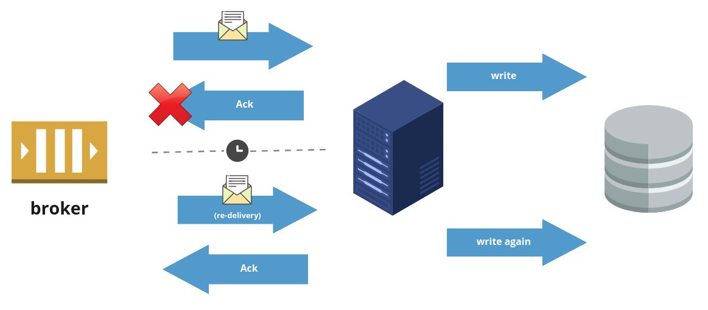
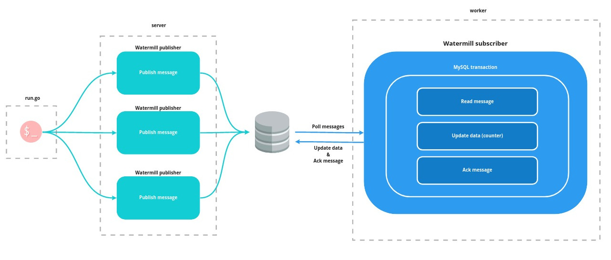

# Exactly-once delivery counter

Is exactly-once delivery impossible? Well, it depends a lot on the definition of exactly-once delivery.
When we assume we want to avoid the situation when a message is delivered more than once when our broker or worker died -- it's possible.
I'll say more, it's even possible with Watermill!

*At-least once delivery - this is not what we want!*

There are just two constraints:
1. you need to use a Pub/Sub implementation that does support exactly-once delivery (only [MySQL/PostgreSQL](https://github.com/ThreeDotsLabs/watermill-sql) for now),
2. writes need to go to the same DB.

In practice, our model is pretty similar to how does it work with Kafka exactly-once delivery. If you want to know more details, you can check [their article](https://www.confluent.io/blog/exactly-once-semantics-are-possible-heres-how-apache-kafka-does-it/).

In our example, we use a MySQL database to implement a **simple counter**. It can be triggered by calling the `http://localhost:8080/count/{counterUUID}` endpoint.
Calling this endpoint will publish a message to MySQL via our [Pub/Sub implementation](https://github.com/ThreeDotsLabs/watermill-sql).
The endpoint is provided by [server/main.go](server/main.go).

Later, the message is consumed by [worker/main.go](worker/main.go). The only responsibility of the worker is to update the counter in the MySQL database.
**Counter update is done in the same transaction as message consumption.**

Normally, we would need to de-duplicate messages. 
But thanks to that fact and [A.C.I.D](https://en.wikipedia.org/wiki/ACID) even if server, worker or network failure happens during processing our data will stay consistent.

*Watermill's exactly-once delivery*

To check if the created code works, I've created a small `run.go` program, that sends 10k requests to the server and verifies if the count at the end is equal to 10k.
But to not make it too easy, I'm restarting the worker and MySQL a couple of times. I also forgot about graceful shutdown in my worker. ;-)

The biggest downside of this approach is performance. Due to [our benchmark](https://github.com/ThreeDotsLabs/watermill-benchmark#sql-mysql), MySQL subscriber can consume up to 154 messages per second.
Fortunately, it's still 13,305,600 messages per day. It's more than enough for a lot of systems.

## Running

    docker-compose up

    go run run.go

*Please note that `run.go` needs to be executed by a user having privileges to manage Docker.
It's due to the fact that `run.go` is restarting containers.*
