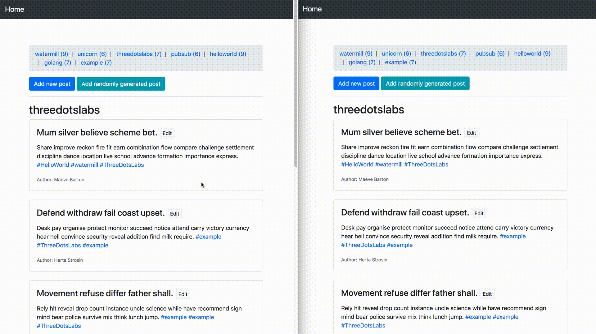
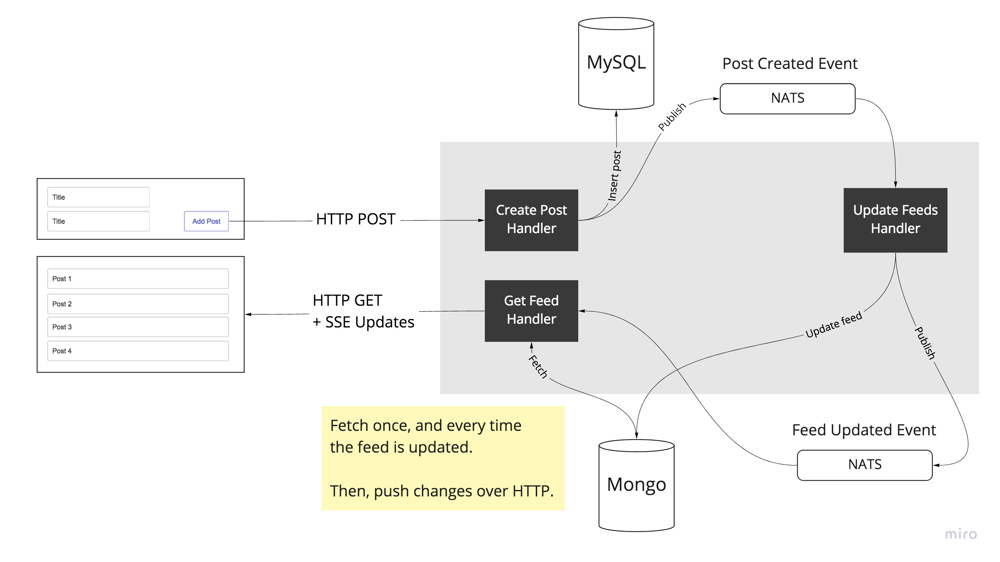

# HTTP Server push using SSE (Server-Sent Events)

This example is a Twitter-like web application using [Server-Sent Events](https://en.wikipedia.org/wiki/Server-sent_events) to support real-time refreshing.



## Running

```
docker-compose up
```

Then, open  http://localhost:8080

You can add your own post or click the button to get randomly generated posts.

Either way, the feeds list and posts in a feed should be always up-to-date. Try using a second browser window to see the update.

## How it works

* Posts can be created and updated.
* Posts can contain tags.
* Each tag has its own feed that contains all posts from that tag.
* All posts are stored in MySQL. This is the Write Model.
* All feeds are updated asynchronously and stored in MongoDB. This is the Read Model.

### Why use separate write and read models? 

For this example application, using polyglot persistence (two database engines) is, of course, an overkill.
We did it to showcase this technique and how easy it is to apply it with Watermill.

A dedicated read model is a useful pattern for applications with high read/write ratio. All writes are applied atomically
to the write model (MySQL in our case). Event handlers asynchronously update the read model (we use Mongo).

The data in the read model is ready to serve as it is. It can also be scaled independently of the write model.

Keep in mind that eventual consistency has to be acceptable in your application to use this pattern.
Also, you probably won't need to use it for most use cases. Be pragmatic!



### SSE Router

The `SSERouter` comes from [watermill-http](https://github.com/ThreeDotsLabs/watermill-http).
When creating a new router, you pass an upstream subscriber. Messages coming from that subscriber will trigger pushing updates over HTTP.

In this example, we use [NATS](https://nats.io/) as Pub/Sub, but this can be any Pub/Sub supported by Watermill.

```go
sseRouter, err := watermillHTTP.NewSSERouter(
    watermillHTTP.SSERouterConfig{
        UpstreamSubscriber: router.Subscriber,
        ErrorHandler:       watermillHTTP.DefaultErrorHandler,
    },
    router.Logger,
)
```

### Stream Adapters

To work with `SSERouter` you need to prepare a `StreamAdapter` with two methods.

`GetResponse` is similar to a standard HTTP handler. It should be super easy to modify an existing handler to match this signature.

`Validate` is an extra method that tells whether an update should be pushed for a particular `Message`.

```go
type StreamAdapter interface {
	// GetResponse returns the response to be sent back to client.
	// Any errors that occur should be handled and written to `w`, returning false as `ok`.
	GetResponse(w http.ResponseWriter, r *http.Request) (response interface{}, ok bool)
	// Validate validates if the incoming message should be handled by this handler.
	// Typically this involves checking some kind of model ID.
	Validate(r *http.Request, msg *message.Message) (ok bool)
}
```

An example `Validate` can look like this. It checks whether the message came for the same post ID that the user sent over the HTTP request.

```go
func (p postStreamAdapter) Validate(r *http.Request, msg *message.Message) (ok bool) {
	postUpdated := PostUpdated{}

	err := json.Unmarshal(msg.Payload, &postUpdated)
	if err != nil {
		return false
	}

	postID := chi.URLParam(r, "id")

	return postUpdated.OriginalPost.ID == postID
}
```

If you'd like to trigger an update for every message, you can simply return `true`.

```go
func (f allFeedsStreamAdapter) Validate(r *http.Request, msg *message.Message) (ok bool) {
	return true
}
```

Before starting the `SSERouter`, you need to add the handler with particular topic.
`AddHandler` returns a standard HTTP handler that can be used in any routing library.

```go
postHandler := sseRouter.AddHandler(PostUpdatedTopic, postStream)

// ...

r.Get("/posts/{id}", postHandler)
```

## Event handlers

The example uses Watermill for all asynchronous communication, including SSE.

There are several events published:

* `PostCreated`
    * Adds the post to all feeds with tags present in the post.
* `FeedUpdated`
    * Pushes update to all clients currently visiting the feed page.
* `PostUpdated`
    * Pushes update to all clients currently visiting the post page.
    * Updates post in all feeds with tags present in the post
        * a) For existing tags, the post content will be updated in the tag.
        * b) If a new tag has been added, the post will be added to the tag's feed.
        * c) If a tag has been deleted, the post will be removed from the tag's feed.

## Frontend app

The frontend application is built using Vue.js and Bootstrap.

The most interesting part is the use of `EventSource`.

```js
this.es = new EventSource('/api/feeds/' + this.feed)

this.es.addEventListener('data', event => {
    let data = JSON.parse(event.data);
    this.posts_stream = data.posts;
}, false);
```

Please note the author is not a frontend developer and the code in `index.html` is probably not idiomatic. PRs are welcome. :)
